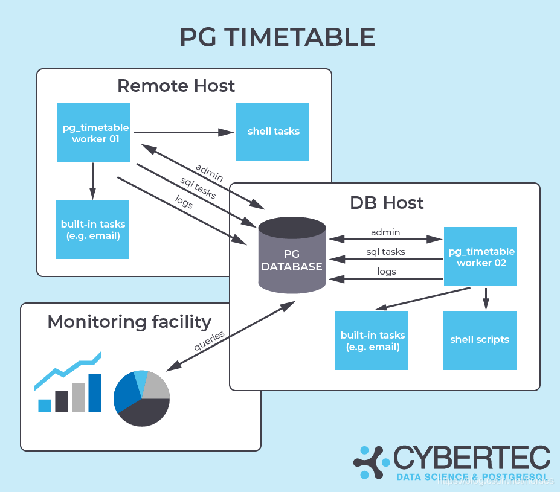
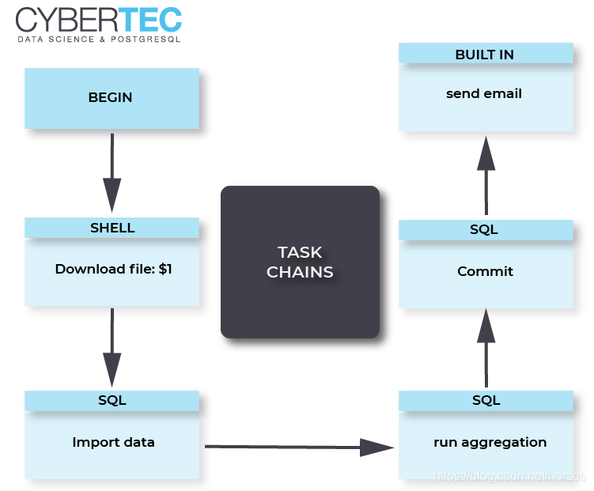

[@id]: 20220101-01.md
[@title]: PostgreSQL 实现定时任务的 4 种方法
[@location]: docs/database/20220101-01.md
[@author]: leity
[@date]: 2022-01-01

## PostgreSQL 实现定时任务的 4 种方法

#### 作者
leity

#### 日期
2021-01-01

#### 标签
数据库，PostgreSQL，定时，crontab，Task Scheduler，pg_cron，pgAgent，pg_timeable

----

## 背景

数据库定时任务可以用于实现定期的备份、统计信息采集、数据汇总、数据清理与优化等。PostgreSQL 没有提供类似 Oracle、MySQL 以及 Microsoft SQL Sever 的内置任务调度功能，因此需要使用其它方法实现定时。

## 第一种、操作系统定时任务

Linux 定时任务（crontab）或者 Windows 任务计划程序（Task Scheduler）为我们提供了一个实现定时任务传统的方法。以 crontab 为例，我们可以使用以下命令编辑任务列表：

```bash
crontab -e

# Example of job definition:
# .---------------- minute (0 - 59)
# |  .------------- hour (0 - 23)
# |  |  .---------- day of month (1 - 31)
# |  |  |  .------- month (1 - 12) OR jan,feb,mar,apr ...
# |  |  |  |  .---- day of week (0 - 6) (Sunday=0 or 7) OR sun,mon,tue,wed,thu,fri,sat
# |  |  |  |  |
# *  *  *  *  * command to be executed
```


## 第二种、pgAgent

pgAgent 是一个用于 PostgreSQL 数据库的任务调度代理，能够基于复杂的调度计划运行多步骤的批处理、shell 脚本以及 SQL 命令。对于 Unix/Linux 系统，pgAgent 以后台进程的方式运行；对于 Windows 系统，pgAgent 以服务的形式运行。

PgAdmin 4 管理工具集成了 pgAgent 的功能，但是这两者需要单独安装。我们可以通过官方网站[下载](https://www.pgadmin.org/download/) PgAdmin 4 以及 pgAgent。具体的安装步骤和注意事项可以参考[官网文档](https://www.pgadmin.org/docs/pgadmin4/latest/pgagent.html)。


## 第三种、pg_cron

[pg_cron ](https://github.com/citusdata/pg_cron)是由 citusdata 公司开发的一个 PostgreSQL 定时任务插件（类似于 Oracle 中的 DBMS_SCHEDULER）。pg_cron 作为一个后台工作进程运行，使用类似 cron 的编辑语法，允许直接在数据库中执行定时任务。

```sql
-- 每周六 3:30am (GMT) 删除历史记录
SELECT cron.schedule('30 3 * * 6', $$DELETE FROM events WHERE event_time < now() - interval '1 week'$$);
 schedule
----------
 42

-- 每天 10:00am (GMT) 执行清理作业
SELECT cron.schedule('nightly-vacuum', '0 10 * * *', 'VACUUM');
 schedule
----------
 43

-- 将清理作业修改为 3:00am (GMT)
SELECT cron.schedule('nightly-vacuum', '0 3 * * *', 'VACUUM');
 schedule
----------
 43

-- 停止计划中的任务
SELECT cron.unschedule('nightly-vacuum' );
 unschedule 
------------
 t
(1 row)

SELECT cron.unschedule(42);
 unschedule
------------
  t
```


## 第四种、pg_timetable

[pg_timetable ](https://www.cybertec-postgresql.com/en/products/pg_timetable/)是由 CYBERTEC 公司开发的 PostgreSQL 作业调度程序，提供了灵活的配置方式和许多高级功能。包括由多个任务组成的任务链、支持 SQL 命令和可执行程序、内置任务（例如发送邮件）、完全基于数据库的配置和日志功能、cron 风格的计划调度、并发执行的保护等。






