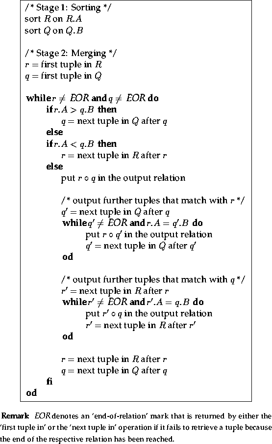
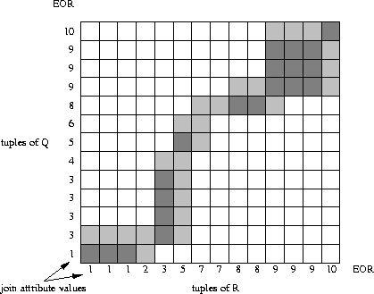
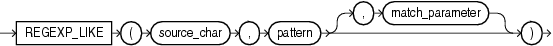
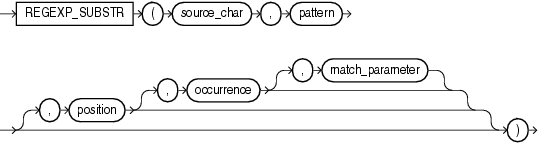
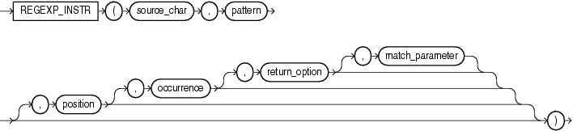
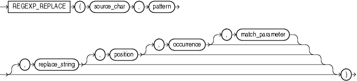

# oracle


# 一、sqlldr导入数据

1、control文件

```plsql
load data
CHARACTERSET UTF8
infile 'F:\in.csv'
truncate /*append*/ into table test_leity_20181011
fields terminated by ',' --字段间用“，”隔开
OPTIONALLY ENCLOSED BY '"'
TRAILING NULLCOLS  
(
city,
service_id 
)
```

2、运行命令

```shell
sqlldr 用户/密码 control=sqlldr.ctl
sqlldr fssc_gd1/fssc2011@132.121.164.141:1521/gdfssc control=D:\eshore\sqlloader\sqlldr.ctl log=D:\eshore\sqlloader\sqlldr.log rows=1000
```


# 二、用户授权

```PLSQL
--表授权
GRANT SELECT ON 表 TO 用户;
```


# 三、行列转置

行转列

```PLSQL
SELECT MAX(CASE WHEN ... THEN ... END)

...

GROUP BY ...
```

列转行

```PLSQL
SELECT ... FROM ...
UNION ALL
SELECT ... FROM ...
```


# 四、spool导出数据

```plsql
--中山预算-实占
SPOOL D:\eshore\GD_V_YS_SZ_0911_2019.txt
set echo off
set feedback off
set heading off
set linesize 1000
set pagesize 0
set termout off
set trimout on
set trimspool on

SELECT 'BUDGET_PROJECT_CODE'||','||
      'BUDGET_PROJECT_NAME'||','||
      'PERIOD'||','||
      'SAP_COMPANY_CODE'||','||
      'BILL_TYPE'||','||
      'FROM_SYS'||','||
      'STATUS'||','||
      'ORG_CODE'||','||
      'ORG_NAME'||','||
      'PRINCIPAL'||','||
      'IS_AMORTIZE'||','||
      'DOC_ID'||','||
      'TOTAL_AMOUNT'||','||
      'SUBDOC_ID'||','||
      'SUB_TOTAL_AMOUNT'||','||
      'ABSTRACT'||','||
      'BUDGET_ITEM_CODE'||','||
      'BUDGET_ITEM_NAME'||','||
      'SAP_ACCOUNT_CODE'||','||
      'SAP_ACCOUNT_NAME'||','||
      'SAP_CERTIFICATE_CODE'||','||
      'SAP_CERTIFICATE_DATE'||','||
      'FLAG'
FROM DUAL;
SELECT BUDGET_PROJECT_CODE||','||
			 BUDGET_PROJECT_NAME||','||
			 PERIOD||','||
			 SAP_COMPANY_CODE||','||
			 BILL_TYPE||','||
			 FROM_SYS||','||
			 STATUS||','||
			 ORG_CODE||','||
			 ORG_NAME||','||
			 PRINCIPAL||','||
			 IS_AMORTIZE||','||
			 DOC_ID||','||
			 TOTAL_AMOUNT||','||
			 SUBDOC_ID||','||
			 SUB_TOTAL_AMOUNT||','||
			 ABSTRACT||','||
			 BUDGET_ITEM_CODE||','||
			 BUDGET_ITEM_NAME||','||
			 SAP_ACCOUNT_CODE||','||
			 SAP_ACCOUNT_NAME||','||
			 SAP_CERTIFICATE_CODE||','||
			 SAP_CERTIFICATE_DATE||','||
			 FLAG
	FROM GD_V_YS_SZ@GD_SAP
 WHERE SUBSTR(ORG_CODE,1,4) = '0911'
 AND SUBSTR(PERIOD,1,4) = '2019';
SPOOL OFF
```


# 五、记录执行日志

```plsql
--记录日志存储过程
CREATE OR REPLACE PROCEDURE pro_record_log(in_start_time IN DATE,
                                           in_end_time IN DATE,
                                           in_code IN VARCHAR2,
                                           in_message IN VARCHAR2)
AS
  /*记录日志*/
  v_owner     VARCHAR2 (30);
  v_name      VARCHAR2 (30);
  v_lineno    NUMBER;
  v_type      VARCHAR2 (30);
BEGIN
  --返回是哪个对象调用了本存储过程记录日志
  owa_util.who_called_me(v_owner,v_name,v_lineno,v_type);
  /*dbms_output.put_line(v_owner||'.'||v_name||' '||v_type);
  dbms_output.put_line(in_code||'**'||in_message);*/
  INSERT INTO tbl_proc_log(proc_name,start_time,end_time,ERROR_CODE,error_message)
  VALUES (v_name,in_start_time,in_end_time,in_code,in_message||DBMS_UTILITY.format_error_backtrace());
  COMMIT;
END;

--测试
CREATE OR REPLACE PROCEDURE pro_test AS
  v_start_time DATE := SYSDATE;
BEGIN
  INSERT INTO uuid VALUES('333');
  COMMIT;
--记日志
  pro_record_log(v_start_time,SYSDATE,Sqlcode,SUBSTR(SQLERRM, 1, 512));
  COMMIT;
EXCEPTION
  WHEN OTHERS THEN
    pro_record_log(v_start_time,SYSDATE,Sqlcode,SUBSTR(SQLERRM, 1, 512));
    COMMIT;
END;
```

# 六、查看对象创建时间

```plsql
SELECT object_name,object_type,created,last_ddl_time,status
	FROM USER_OBJECTS@GD_NONSAP
 WHERE OBJECT_NAME IN ('CT_CONTRACT');
```

# 七、表赋权

```plsql
GRANT SELECT ON CT_CONTRACT to gd_wisfi;
GRANT SELECT ON CT_CONTRACT_HOUSE to gd_wisfi;
GRANT SELECT ON CT_CONTRACT_LAND to gd_wisfi;
GRANT SELECT ON LH_LAND to gd_wisfi;
GRANT SELECT ON LH_FLOOR to gd_wisfi;
GRANT SELECT ON LH_HOUSE to gd_wisfi;
GRANT SELECT ON LH_ROOM to gd_wisfi;

--查看表赋权情况
select * from user_tab_privs
where table_name in ('CT_CONTRACT','CT_CONTRACT_HOUSE','CT_CONTRACT_LAND',
	'LH_LAND','LH_FLOOR','LH_HOUSE','LH_ROOM');
```

# 八、停止job

```plsql
--停止job
declare
	v_job number := 907;
	v_cnt number;
	v_sid number;
	v_ser number;
begin
	select max(sid) into v_sid  from dba_jobs_running where job = v_job;
	if nvl(v_sid,0) = 0 then
	   return;
	end if;
	dbms_job.broken(v_job,true);
	commit;
	select serial#  into v_ser from v$session where sid = v_sid;
	execute immediate 'alter system kill session '''||v_sid||','||v_ser||'''';
end; 
```

# 九、表死锁

```plsql
--被锁对象查看
WITH LOCKED_OBJECT AS --查被锁的表
 (SELECT S.SID,
				 S.SERIAL#,
				 P.SPID,
				 S.STATUS,
				 LO.LOCKED_MODE,
				 LO.OBJECT_ID,
				 OBJ.OBJECT_NAME,
				 OBJ.OBJECT_TYPE,
				 S.LAST_CALL_ET,
				 S.PROCESS,
				 LO.ORACLE_USERNAME,
				 LO.OS_USER_NAME
		FROM V$LOCKED_OBJECT LO, V$SESSION S, DBA_OBJECTS OBJ, V$PROCESS P
	 WHERE LO.OBJECT_ID = OBJ.OBJECT_ID
		 AND LO.SESSION_ID = S.SID
		 AND S.PADDR = P.ADDR),
SESSION_SQL AS --查session的sql
 (SELECT S.SID,
				 S.SERIAL#,
				 THIS_SQL.SQL_TEXT     THIS_SQL_TEXT,
				 THIS_SQL.SQL_FULLTEXT THIS_SQL_FULLTEXT,
				 PREV_SQL.SQL_TEXT     PREV_SQL_TEXT,
				 PREV_SQL.SQL_FULLTEXT PREV_SQL_FULLTEXT,
				 S.USERNAME,
				 S.SCHEMANAME
		FROM V$SESSION S, V$SQLAREA THIS_SQL, V$SQLAREA PREV_SQL
	 WHERE S.SQL_HASH_VALUE = THIS_SQL.HASH_VALUE(+)
		 AND S.PREV_HASH_VALUE = PREV_SQL.HASH_VALUE(+)),
SESSION_HISTORY_SQL AS --查session的历史sql
 (SELECT S.SESSION_ID SID,
				 S.SESSION_SERIAL# SERIAL#,
				 TO_CHAR(S.SAMPLE_TIME, 'yyyy-mm-dd hh24:mi:ss') SAMPLE_TIME,
				 SQL.SQL_TEXT,
				 SQL.SQL_FULLTEXT,
				 SQL.DISK_READS,
				 SQL.BUFFER_GETS,
				 SQL.CPU_TIME,
				 SQL.ROWS_PROCESSED
		FROM V$SQLAREA SQL, V$ACTIVE_SESSION_HISTORY S
	 WHERE S.SQL_ID = SQL.SQL_ID)

SELECT *
	FROM LOCKED_OBJECT LO, SESSION_SQL SS, SESSION_HISTORY_SQL SHS
 WHERE LO.SID = SS.SID AND LO.SERIAL# = SS.SERIAL# AND LO.SID = SHS.SID AND LO.SERIAL# = SHS.SERIAL# AND ROWNUM <= 5;


```

```plsql
--查哪个session阻塞了哪个session
WITH LOCK_BLOCK AS
 (SELECT SID, TYPE, ID1, ID2, LMODE, REQUEST, CTIME, BLOCK, CON_ID
		FROM V$LOCK
	 WHERE BLOCK > 0),
LOCK_REQUEST AS
 (SELECT SID, TYPE, ID1, ID2, LMODE, REQUEST, CTIME, BLOCK, CON_ID
		FROM V$LOCK
	 WHERE REQUEST > 0),
SESSION_SQL AS --查session的sql
 (SELECT S.SID,
				 S.SERIAL#,
				 THIS_SQL.SQL_TEXT     THIS_SQL_TEXT,
				 THIS_SQL.SQL_FULLTEXT THIS_SQL_FULLTEXT,
				 PREV_SQL.SQL_TEXT     PREV_SQL_TEXT,
				 PREV_SQL.SQL_FULLTEXT PREV_SQL_FULLTEXT,
				 S.USERNAME,
				 S.SCHEMANAME,
				 S.MACHINE
		FROM V$SESSION S, V$SQLAREA THIS_SQL, V$SQLAREA PREV_SQL
	 WHERE S.SQL_HASH_VALUE = THIS_SQL.HASH_VALUE(+)
		 AND S.PREV_HASH_VALUE = PREV_SQL.HASH_VALUE(+))

SELECT LBS.USERNAME || '@' || LBS.MACHINE || ' ( SID=' || LBS.SID || ' ) is blocking ' || LRS.USERNAME || '@' || LRS.MACHINE || ' ( SID=' || LRS.SID || ' ) ' AS BLOCKING_STATUS,
			 LBS.THIS_SQL_TEXT,
			 LBS.PREV_SQL_TEXT,
       LRS.THIS_SQL_TEXT,
			 LRS.PREV_SQL_TEXT,
       LB.*,
			 LR.*
	FROM LOCK_BLOCK LB, LOCK_REQUEST LR, SESSION_SQL LBS, SESSION_SQL LRS
 WHERE LB.ID1 = LR.ID1
	 AND LB.ID2 = LR.ID2
	 AND LB.SID = LBS.SID
	 AND LR.SID = LRS.SID;

```

```plsql
--查session历史sql记录
SELECT S.SESSION_ID SID,
				 S.SESSION_SERIAL# SERIAL#,
				 TO_CHAR(S.SAMPLE_TIME, 'yyyy-mm-dd hh24:mi:ss') SAMPLE_TIME,
				 SQL.SQL_TEXT,
				 SQL.SQL_FULLTEXT,
				 SQL.DISK_READS,
				 SQL.BUFFER_GETS,
				 SQL.CPU_TIME,
				 SQL.ROWS_PROCESSED
		FROM V$SQLAREA SQL, V$ACTIVE_SESSION_HISTORY S
	 WHERE S.SQL_ID = SQL.SQL_ID
   AND S.SESSION_ID = 37

```

```plsql
--kill掉session  'sid,serial#'
alter system kill session 'sid,serial#' [immediate];
alter system disconnect session '4,32509' [immediate];

SQL> ALTER SYSTEM DISCONNECT SESSION 'sid,serial#' POST_TRANSACTION;

SQL> ALTER SYSTEM DISCONNECT SESSION 'sid,serial#' IMMEDIATE;
```

```plsql
--相关数据字典
1、v$session

记录会话及锁的信息

2、v$session_wait

记录会话的等待信息

3、v$lock

锁信息

4、v$locked_object

当前被锁对象的信息

5、dba_locks

对V$lock的格式化视图

6、dba_blockers

正在阻塞资源的会话

7、dba_waiters

正在等待锁资源的会话

8、v$latch

锁存器信息

9、v$latch_misses

latch争用的丢失统计
```

# 十、查看正在执行的sql语句

```plsql
--RAC
SELECT s.sid,sql.SQL_TEXT,sql.SQL_FULLTEXT,s.USERNAME,s.SCHEMANAME,s.INST_ID
FROM gv$session s,gv$sqlarea SQL
WHERE s.sql_hash_value = sql.HASH_VALUE
AND s.inst_id = sql.inst_id
AND s.sid = 850;

--单机
SELECT s.sid,sql.SQL_TEXT,sql.SQL_FULLTEXT,s.USERNAME,s.SCHEMANAME
FROM gv$session s,gv$sqlarea SQL
WHERE s.sql_hash_value = sql.HASH_VALUE
AND s.sid = 850;
```


# 十一、数组，自定义类型

```plsql
/*table()函数，type类型，数组的用法*/

--创建表
CREATE TABLE emp(
  EMPNO NUMBER(4,0), 
  ENAME VARCHAR2(10), 
  JOB VARCHAR2(9), 
  MGR NUMBER(4,0), 
  HIREDATE DATE, 
  SAL NUMBER(7,2), 
	COMM NUMBER(7,2), 
	DEPTNO NUMBER(2,0)
);

--创建type
CREATE OR REPLACE TYPE type_emp FORCE AS OBJECT(
  EMPNO NUMBER(4,0), 
  ENAME VARCHAR2(10), 
  JOB VARCHAR2(9), 
  MGR NUMBER(4,0), 
  HIREDATE DATE, 
  SAL NUMBER(7,2), 
	COMM NUMBER(7,2), 
	DEPTNO NUMBER(2,0)
);

--以上定义的类型可以用来创建表
CREATE TABLE emp_1 OF type_emp;

--创建数组
CREATE OR REPLACE TYPE type_arr AS TABLE OF type_emp;

```


# 十二、查看最后一次DML的时间

```plsql
SELECT to_char(SCN_TO_TIMESTAMP(MAX(ORA_ROWSCN)),'yyyy-mm-dd hh24:mi:ss') last_dml_time 
FROM GD_V_BSEG_VAT

```

# 十三、connect by

```plsql
--connect by
SELECT * FROM TABLE 
  START WITH CONDITION1 
  CONNECT BY PRIOR ID = PARENTID

--CONNECT_BY_ROOT方法获取第一层集结点结果集中的任意字段的值即level = 1那一行的值
select t.*, level, CONNECT_BY_ROOT(job)
  from emp t
 start with t.empno = 7839
connect by prior t.empno = t.mgr;

--向下查找叶子节点
select t.*, level, CONNECT_BY_ROOT(job)
  from emp t
 start with t.empno = 7839
connect by prior t.empno = t.mgr;

--向上查找父节点
select t.*, level, CONNECT_BY_ROOT(job)
  from emp t
 start with t.empno = 7566
connect by t.empno = PRIOR t.mgr;

--使用rownum实现1到10的序列
select rownum from dual connect by rownum<=10;

--使用level实现1到10的序列
select level from dual connect by level<=10;

```

# 十四、时间间隔（1h2m3s）

```plsql
--NUMTODSINTERVAL
--numtoyminterval
--extract

SELECT t.table_name,t.job_start_time,t.job_end_time,
       extract(HOUR FROM to_timestamp(job_end_time,'yyyy-mm-dd hh24:mi:ss')-to_timestamp(job_start_time,'yyyy-mm-dd hh24:mi:ss')) || ':' ||
       extract(MINUTE FROM to_timestamp(job_end_time,'yyyy-mm-dd hh24:mi:ss')-to_timestamp(job_start_time,'yyyy-mm-dd hh24:mi:ss')) || ':' ||
       extract(SECOND FROM to_timestamp(job_end_time,'yyyy-mm-dd hh24:mi:ss')-to_timestamp(job_start_time,'yyyy-mm-dd hh24:mi:ss')) job_time,
       extract(HOUR FROM NUMTODSINTERVAL(to_date(job_end_time,'yyyy-mm-dd hh24:mi:ss') - to_date(job_start_time,'yyyy-mm-dd hh24:mi:ss'),'day')) || ':' ||
       extract(MINUTE FROM NUMTODSINTERVAL(to_date(job_end_time,'yyyy-mm-dd hh24:mi:ss') - to_date(job_start_time,'yyyy-mm-dd hh24:mi:ss'),'day')) || ':' ||
       extract(SECOND FROM NUMTODSINTERVAL(to_date(job_end_time,'yyyy-mm-dd hh24:mi:ss') - to_date(job_start_time,'yyyy-mm-dd hh24:mi:ss'),'day')) job_time1
FROM report_table@gd_nonsap t
WHERE job_end_time BETWEEN to_char(SYSDATE-30,'yyyy.mm.dd hh24:mi:ss') AND to_char(SYSDATE,'yyyy.mm.dd hh24:mi:ss')
AND table_name = 'CONTRACT_TO_OPPOSITE'
ORDER BY job_end_time DESC

```

# 十五、REGEXP_SUBSTR行变列

```plsql
SELECT REGEXP_SUBSTR('A,B,C,D,E','[^,]+',1,LEVEL) AS STR FROM DUAL
CONNECT BY LEVEL <= REGEXP_COUNT('A,B,C,D,E','[^,]+');


ID	COL
1	A,B,C,D
2	AA,BB,CC,DD


WITH TEMP0 AS
 (SELECT LEVEL LV FROM DUAL CONNECT BY LEVEL <= 100)
	SELECT ID,REGEXP_SUBSTR (VALS,'[^,]+', 1,TV.LV)
  FROM (SELECT ID, col AS VALS,regexp_count(col,'[^,]+') AS CNT
					FROM tt_split) T
	JOIN TEMP0 TV
		ON TV.LV <= T.CNT
 ORDER BY 1;


ORACLE中的支持正则表达式的函数主要有下面四个：
1，REGEXP_LIKE ：与LIKE的功能相似
2，REGEXP_INSTR ：与INSTR的功能相似
3，REGEXP_SUBSTR ：与SUBSTR的功能相似
4，REGEXP_REPLACE ：与REPLACE的功能相似
它们在用法上与Oracle SQL 函数LIKE、INSTR、SUBSTR 和REPLACE 用法相同，
但是它们使用POSIX 正则表达式代替了老的百分号（%）和通配符（_）字符。
POSIX 正则表达式由标准的元字符（metacharacters）所构成：
'^' 匹配输入字符串的开始位置，在方括号表达式中使用，此时它表示不接受该字符集合。
'$' 匹配输入字符串的结尾位置。如果设置了 RegExp 对象的 Multiline 属性，则 $ 也匹
配 '\n' 或 '\r'。
'.' 匹配除换行符之外的任何单字符。
'?' 匹配前面的子表达式零次或一次。
'+' 匹配前面的子表达式一次或多次。
'*' 匹配前面的子表达式零次或多次。
'|' 指明两项之间的一个选择。例子'^([a-z]+|[0-9]+)$'表示所有小写字母或数字组合成的
字符串。
'( )' 标记一个子表达式的开始和结束位置。
'[]' 标记一个中括号表达式。
'{m,n}' 一个精确地出现次数范围，m=<出现次数<=n，'{m}'表示出现m次，'{m,}'表示至少
出现m次。
\num 匹配 num，其中 num 是一个正整数。对所获取的匹配的引用。
字符簇： 
[[:alpha:]] 任何字母。
[[:digit:]] 任何数字。
[[:alnum:]] 任何字母和数字。
[[:space:]] 任何空白字符。
[[:upper:]] 任何大写字母。
[[:lower:]] 任何小写字母。
[[:punct:]] 任何标点符号。
[[:xdigit:]] 任何16进制的数字，相当于[0-9a-fA-F]。


DECLARE
  V_CHAR VARCHAR2(4000) := 'A,B,C';
  V_TAG VARCHAR2(10) := ',';
  TT SYS_REFCURSOR;
  REC SPLIT%ROWTYPE;
BEGIN
  OPEN TT FOR '
  SELECT REGEXP_SUBSTR ('''||V_CHAR||''', ''[^'||V_TAG||']+'', 1,rownum) AS COL FROM DUAL
  CONNECT BY ROWNUM <= REGEXP_COUNT ('''||V_CHAR||''', ''[^'||V_TAG||']+'')';
    
  LOOP
    FETCH TT INTO REC;
    EXIT WHEN TT%NOTFOUND;
    DBMS_OUTPUT.PUT_LINE(REC.COL);
  END LOOP;
  CLOSE TT;
END;

```


# 十六、translate函数

```plsql
--1、替换

--abc4567
select translate('1234567','123' ,'abc') from dual ;--1替换为a,2替换为b,3替换为c

--ab4567
select translate('1234567','123' ,'ab') from dual;--3替换为空;

--abc4567
select translate('1234567','123' ,'abccd') from dual;

--空
select translate('1234567','123' ,'') from dual;

--4567
select translate('1234567','#123' ,'#') from dual;

--你师看了三楼的开发   
select translate('你师看了3三楼2的6开8发','#0123456789' ,'#') from dual;  --过滤掉数字

--3268
select translate('你师看了3三楼2的6开8发','#'||translate('你师看了3三楼2的6开8发','#0123456789' ,'#'),'#') from dual; --过滤掉非数字

--1
select 1  from dual where
 translate('顶顶顶123','123' ,'aaaaaaaaaa') =translate('顶顶顶132','132' ,'aaaaaaaaaa')

--2229
SELECT TRANSLATE('2KRW229','0123456789ABCDEFGHIJKLMNOPQRSTUVWXYZ','0123456789') "Translate example"FROM DUAL; --只保留数字


--2、tranlate using将char类型在数据库字符集和国家字符集中进行转换，建议使用to_char和to_nchar函数
SELECT TRANSLATE('。中国\*/-' USING NCHAR_CS) FROM dual;
SELECT to_nchar('。中国\*/-') FROM dual;


```

# 十七、动态SQL

```plsql
--insert,update,delete
execute immediate 动态SQL语句 using 绑定参数列表 returning into 输出参数列表;

--select
execute immediate 'select count(*) from user_tables where table_name = upper(''emp'')' into v_cnt;


--动态sql执行plsql代码块
--创建存储过程供动态sql执行
CREATE OR REPLACE PROCEDURE pro_create_dept (
  deptid IN OUT NUMBER,
  dname  IN     VARCHAR2,
  loc  IN     VARCHAR2
) AS
BEGIN
  INSERT INTO dept (
    deptno,
    dname,
    loc)
  VALUES (deptid, dname, loc);
  COMMIT;
END;

DECLARE
  new_deptid  NUMBER(4) := 99;
  new_dname   VARCHAR2(30) := 'Ad';
  new_loc   VARCHAR2(100)    := 'loc';
BEGIN
  --绑定变量有 in/out
  EXECUTE IMMEDIATE 'BEGIN pro_create_dept(:deptno, :dname, :loc); END;'
    USING IN OUT new_deptid, IN new_dname, IN new_loc;    --指定in/out，默认为 in，如果为 in可省略不写
  	--写成这样也可以 ...,IN 'location'   直接用常量
  dbms_output.put_line(new_deptid);
END;


DECLARE
  a_null  CHAR(1);  --未初始化
BEGIN
  EXECUTE IMMEDIATE 'UPDATE employees_temp SET commission_pct = :x'
    USING a_null;  --未初始化的变量未NULL
END;


--ref cursor/sys_cursor
open v_cursor for 'select * from emp where deptno = :deptno' using v_deptno;


```


# 十八、LISTAGG和WM_CONCAT函数

```plsql
--listagg
select deptno,COUNT(ename)
FROM emp
GROUP BY deptno;

SELECT deptno,listagg(ename||'('||empno||')',';') WITHIN GROUP(ORDER BY deptno)
FROM emp
GROUP BY deptno;

--wm_concat
SELECT depno,to_char(wm_concat(ename||'('||empno||')'))
FROM emp
GROUP BY depno

```

# 十九、表分析

```plsql
analyze table t1 compute statistics for table; --针对表收集信息

analyze table t2 compute statistics for allcolumns; --针对表字段收集信息

analyze table t3 compute statistics for all indexescolumns; --收集索引字段信息

analyze table t4 compute statistics;       --收集表，表字段，索引信息

analyze table t5 compute statistics for all indexes;         --收集索引信息

analyze table t6 compute statistics for table for all indexes for all columns;   --

BEGIN
  DBMS_STATS.GATHER_TABLE_STATS(ownname          => 'gd_nonsap',
                                tabname          => 'WRITEOFF_DETAIL_2018',
                                estimate_percent => 100,
                                no_invalidate    => FALSE, --立马生效
                                degree           => 2,  --并行
                                cascade          => TRUE);
END;


```

# 二十、表空间大小统计

```plsql
SELECT a.tablespace_name "表空间名",
round(total / (1024 * 1024 * 1024),2) "表空间大小(G)",
round(free / (1024 * 1024 * 1024),2) "表空间剩余大小(G)",
round((total - free) / (1024 * 1024 * 1024),2) "表空间使用大小(G)",
round((total - free) / total, 4) * 100 "使用率 %"
FROM (SELECT tablespace_name, SUM(bytes) free
FROM dba_free_space
GROUP BY tablespace_name) a,
(SELECT tablespace_name, SUM(bytes) total
FROM dba_data_files
GROUP BY tablespace_name) b
WHERE a.tablespace_name = b.tablespace_name;

```


# 二十一、收缩表段（shrink space）

```plsql
--收缩表段，降低高水位线
alter table table_name enable row movement;
alter table table_name shrink space;

```


# 二十二、SYS_REFCURSOR

```plsql

```


# 二十三、wrap 和 unwrap( 加密与解密) 

```plsql

```


# 二十四、集合类型

```plsql
--关联数组，嵌套表，可变长数组
--1、关联数组，只能在使用的时候定义，不能作为对象保存到数据库 只有一列

--定义 index_type：BINARY_INTEGER，PLS_INTEGER,VARCHAR2
TYPE table_type_name IS TABLE OF datatype [ NOT NULL] INDEX BY index_type;

--例子1
declare
  type index_tab_type is table of varchar2(30) index by BINARY_INTEGER;
  v_arr index_tab_type;
begin
  v_arr(-1) :='hello';--设定下标为-1的元素的值
  v_arr(1)  :=',';
  dbms_output.put_line(v_arr(-1)||'-'||v_arr(1));
  dbms_output.put_line('元素个数：'||v_arr.count);
  v_arr(5) :='world';
  dbms_output.put_line('元素个数：'||v_arr.count);
  dbms_output.put_line('第一个元素'||v_arr.first);
  dbms_output.put_line('最后一个元素'||v_arr.last);
end;

--例子2
declare
  type index_tab_type is table of varchar2(30) index by varchar2(30);
  v_table index_tab_type;
  v_record emp%rowtype;
begin
  --emp表中查询3条记录，以name-job的形式存储到索引表中
  select * into v_record from emp where emp.empno=7788;
  v_table(v_record.ename):= v_record.job;
  select * into v_record from emp where emp.empno=7844;
  v_table(v_record.ename):= v_record.job;
  select * into v_record from emp where emp.empno=7900;
  v_table(v_record.ename):= v_record.job;
  dbms_output.put_line(v_table.count);--3
  dbms_output.put_line(v_table(v_record.ename));--CLERK
end;


--2、嵌套表 下标从1开始 int类型下标

--定义嵌套表类型
CREATE [OR REPLACE] TYPE type_name AS | IS TABLE OF element_datatype [ NOT NULL ];
TYPE type_name IS TABLE OF element_datatype [ NOT NULL ];

--例子1
declare
     type nest_table_type is table of emp.ename%type;
     v_nest_tab nest_table_type;
begin
     v_nest_tab :=nest_table_type('x');--初始化 必须！ 语句 type_name(...)
     select ename into v_nest_tab(1) from emp where empno=7788;
     dbms_output.put_line(v_nest_tab(1));
end;

--例子2
 create type nest_tab_type is table of varchar2(30);   
  create table test_nest_tab(  
     id int,  
     vals nest_tab_type --使用  
  ) nested table vals store as nest_tab;--vals字段用嵌套表存储，表明nest_tab  
  --上面语句执行完之后，在生成TEST_NEST_TAB的同时会生出一个关联表NEST_TAB用来存储关联表的数据  
--插入数据  
insert into test_nest_tab values(1,nest_tab_type('one','two','three','four'));  
--查询数据  
declare   
  v_id int;  
  v_tab nest_tab_type;  
begin  
  select * into v_id,v_tab from test_nest_tab where id=1;  
  dbms_output.put_line(v_id);  
  for i in 1..v_tab.count loop  
  dbms_output.put_line(v_tab(i));  
  end loop;  
end;  


```


# 二十五、管道函数

```plsql
pipe

```


# 二十六、LIKE操作转义

```plsql
SELECT * FROM EMP WHERE ENAME LIKE 'ORIG\_LEO' ESCAPE '\';

```

```PLSQL
SELECT * FROM EMP WHERE ENAME LIKE 'SC\%' ESCAPE '\';

```


# 二十七、分析函数

```plsql
SELECT EMPNO,
			 ENAME,
			 JOB,
			 MGR,
			 HIREDATE,
			 DEPTNO,
			 SAL,
			 ROUND(AVG(SAL) OVER(), 2) AVG_ALL_SAL,
			 ROUND(AVG(SAL) OVER(PARTITION BY DEPTNO), 2) AVG_DEPT_SAL,
			 ROUND(AVG(SAL) OVER(PARTITION BY DEPTNO ORDER BY EMPNO
									ROWS BETWEEN 1 PRECEDING AND 1 FOLLOWING),2) AVG_SAL1,
			 ROUND(AVG(SAL) OVER(PARTITION BY DEPTNO ORDER BY EMPNO
									ROWS BETWEEN CURRENT ROW AND 1 FOLLOWING),2) AVG_SAL2
	FROM EMP;
  
  
SELECT EMPNO,
			 ENAME,
			 JOB,
			 MGR,
			 HIREDATE,
			 DEPTNO,
			 SAL,
			 COMM,
			 COUNT(1) OVER() QTY1,
			 COUNT(*) OVER() QTY2,
			 COUNT(COMM) OVER() QTY3,
			 COUNT(DISTINCT DEPTNO) OVER() QTY4,
			 COUNT(1) OVER(PARTITION BY DEPTNO) QTY5
	FROM EMP;
  
  
SELECT EMPNO,
			 ENAME,
			 JOB,
			 MGR,
			 HIREDATE,
			 SAL,
			 DEPTNO,
			 ROW_NUMBER() OVER(ORDER BY SAL) RN1, --并列序号不一样
			 ROW_NUMBER() OVER(PARTITION BY DEPTNO ORDER BY SAL) RN2,
			 RANK() OVER(ORDER BY SAL) RN3, --并列序号一样，跳号，如：1，1，3，4
			 RANK() OVER(PARTITION BY DEPTNO ORDER BY SAL) R4,
			 DENSE_RANK() OVER(PARTITION BY DEPTNO ORDER BY SAL) R5 --并列序号一样，不跳号，如：1，1，2，3，4
	FROM EMP;


SELECT EMPNO,
			 ENAME,
			 JOB,
			 MGR,
			 HIREDATE,
			 SAL,
			 DEPTNO,
			 FIRST_VALUE(SAL) OVER(PARTITION BY DEPTNO ORDER BY SAL) SAL,
			 FIRST_VALUE(SAL) OVER(PARTITION BY DEPTNO ORDER BY SAL DESC) SAL2
	FROM EMP;


--
SELECT EMPNO,
			 ENAME,
			 JOB,
			 MGR,
			 HIREDATE,
			 SAL,
			 DEPTNO,
			 LAST_VALUE(SAL) OVER(PARTITION BY DEPTNO ORDER BY SAL) SAL1,
			 LAST_VALUE(SAL) OVER(PARTITION BY DEPTNO ORDER BY SAL RANGE BETWEEN UNBOUNDED PRECEDING AND CURRENT ROW) SAL2,
			 LAST_VALUE(SAL) OVER(PARTITION BY DEPTNO ORDER BY SAL RANGE BETWEEN UNBOUNDED PRECEDING AND UNBOUNDED FOLLOWING) SAL3,
			 LAST_VALUE(SAL) OVER(PARTITION BY DEPTNO ORDER BY SAL RANGE BETWEEN CURRENT ROW AND UNBOUNDED FOLLOWING) SAL4,
			 LAST_VALUE(SAL) OVER(PARTITION BY DEPTNO ORDER BY SAL DESC RANGE BETWEEN UNBOUNDED PRECEDING AND UNBOUNDED FOLLOWING) SAL5,
			 LAST_VALUE(SAL) OVER(PARTITION BY DEPTNO ORDER BY SAL ROWS BETWEEN UNBOUNDED PRECEDING AND UNBOUNDED FOLLOWING) SAL6
	FROM EMP;


--
SELECT EMPNO,
			 ENAME,
			 JOB,
			 MGR,
			 HIREDATE,
			 SAL,
			 DEPTNO,
			 LAG(SAL) OVER(PARTITION BY DEPTNO ORDER BY SAL) SAL1,
			 LAG(SAL, 1) OVER(PARTITION BY DEPTNO ORDER BY SAL) SAL2,  --sal向下移动1行，超出用NULL
			 LAG(SAL, 2, 0) OVER(PARTITION BY DEPTNO ORDER BY SAL) SAL3  --sal向下移动2行，超出用0
	FROM EMP; 
  
--
SELECT EMPNO,
			 ENAME,
			 JOB,
			 MGR,
			 HIREDATE,
			 SAL,
			 DEPTNO,
			 LEAD(SAL) OVER(PARTITION BY DEPTNO ORDER BY SAL) SAL1,
			 LEAD(SAL, 1) OVER(PARTITION BY DEPTNO ORDER BY SAL) SAL2,
			 LEAD(SAL, 2, 0) OVER(PARTITION BY DEPTNO ORDER BY SAL) SAL3
	FROM EMP;
  
--
SELECT EMPNO,
			 ENAME,
			 JOB,
			 MGR,
			 HIREDATE,
			 SAL,
			 DEPTNO,
			 LISTAGG(ENAME, ',') WITHIN GROUP(ORDER BY EMPNO) OVER(PARTITION BY DEPTNO) NAME1
	FROM EMP;
  
--
SELECT DEPTNO,
			 DBMS_LOB.SUBSTR(SUBSTR(RTRIM(XMLCAST(XMLAGG(XMLELEMENT(E,ENAME || ',') ORDER BY EMPNO) AS CLOB),','),1,100)) NAME
	FROM EMP
 GROUP BY DEPTNO;

--
SELECT EMPNO,
			 ENAME,
			 JOB,
			 MGR,
			 HIREDATE,
			 SAL,
			 DEPTNO,
			 MAX(SAL) OVER() SAL1,
			 MAX(SAL) OVER(PARTITION BY DEPTNO) SAL2,
			 MAX(SAL) OVER(PARTITION BY DEPTNO ORDER BY EMPNO ROWS BETWEEN UNBOUNDED PRECEDING AND 1 FOLLOWING) SAL3,
			 MIN(SAL) OVER() SAL4,
			 MIN(SAL) OVER(PARTITION BY DEPTNO) SAL5,
			 MIN(SAL) OVER(PARTITION BY DEPTNO ORDER BY EMPNO ROWS BETWEEN UNBOUNDED PRECEDING AND 1 FOLLOWING) SAL6,
			 SUM(SAL) OVER() SAL7,
			 SUM(SAL) OVER(PARTITION BY DEPTNO) SAL8,
			 SUM(SAL) OVER(PARTITION BY DEPTNO ORDER BY EMPNO ROWS BETWEEN UNBOUNDED PRECEDING AND 1 FOLLOWING) SAL9
	FROM EMP;


--
SELECT EMPNO,
			 ENAME,
			 JOB,
			 MGR,
			 HIREDATE,
			 SAL,
			 DEPTNO,
			 CUME_DIST() OVER(ORDER BY SAL) P1,
			 CUME_DIST() OVER(PARTITION BY DEPTNO ORDER BY SAL) P2
	FROM EMP
 ORDER BY DEPTNO, SAL;
 

--
SELECT EMPNO,
			 ENAME,
			 JOB,
			 MGR,
			 HIREDATE,
			 SAL,
			 DEPTNO,
			 PERCENT_RANK() OVER(ORDER BY SAL) P1,
			 PERCENT_RANK() OVER(PARTITION BY DEPTNO ORDER BY SAL) P2
	FROM EMP
 ORDER BY DEPTNO, SAL;

--
select DEPTNO,sum(sal) from emp group by DEPTNO;
select JOB,DEPTNO,sum(sal) from emp group by rollup(JOB,DEPTNO);

SELECT EMPNO,
			 ENAME,
			 ENAME,
			 HIREDATE,
			 SAL,
			 DEPTNO,
			 RATIO_TO_REPORT(SAL) OVER() AS PCT1L,
			 RATIO_TO_REPORT(SAL) OVER(PARTITION BY DEPTNO) AS PCT2,
			 ROUND(RATIO_TO_REPORT(SAL) OVER(PARTITION BY DEPTNO), 4) * 100 || '%' AS PCT3
	FROM EMP;


```


## ROWS BETWEEN ... AND ... 物理窗口

rows是物理窗口，即根据order by 子句排序后，取的前N行及后N行的数据计算（与当前行的值无关，只与排序后的行号相关）

```plsql
/*
ROWS BETWEEN ... AND ...

UNBOUNDED PRECEDING  分区内第一行
1 PRECEDING          分区内当前行前一行
CURRENT ROW          分区内当前行
1 FOLLOWING          分区内当前行后一行
UNBOUNDED FOLLOWING  分区内最后一行
*/


SELECT mid,mdate,msum,
       MAX(msum) OVER(PARTITION BY mid ORDER BY mdate ROWS BETWEEN 5 PRECEDING AND 1 PRECEDING) max_msum1,  --当前行前第5行到当前行前一行,共5行
	   MAX(msum) OVER(PARTITION BY mid ORDER BY mdate ROWS BETWEEN 5 PRECEDING AND CURRENT ROW) max_msum2,  --当前行前第5行到当前行,共6行
	   MAX(msum) OVER(PARTITION BY mid ORDER BY mdate ROWS 5 PRECEDING) max_msum3,  --与上面等价，当前行前第5行到当前行,共6行
	   MAX(msum) OVER(PARTITION BY mid ORDER BY mdate ROWS BETWEEN CURRENT ROW AND 1 FOLLOWING) max_msum4  --当前行和后一行共2行
FROM leity_test_3
WHERE mdate <= '20190105'


```

## RANGE

range是逻辑窗口，是指定当前行对应值的范围取值，列数不固定，只要行值在范围内

order by 的字段只能有一个（假设字段名叫A），选择行是由A字段值决定的。range 5 preceding and 

```plsql
SELECT mid,mdate,msum,
       MAX(msum) OVER(PARTITION BY mid ORDER BY to_date(mdate,'yyyymmdd') RANGE 1 PRECEDING) max_msum1
FROM leity_test_3
WHERE mdate <= '20190105'

```


# 二十八、ROOLUP函数

多次group by需要union时考虑使用

官方说明：https://docs.oracle.com/cd/E11882_01/server.112/e25554/aggreg.htm#DWHSG8634

​					https://docs.oracle.com/database/121/DWHSG/preface.htm#DWHSG8052

逐一递减

ROLLUP(A,B,C)

<==>

A,B,C

A,B

A

NULL


```plsql
SELECT DEPTNO, JOB, SUM(SAL) SAL 
FROM EMP 
GROUP BY ROLLUP(DEPTNO), JOB;

SELECT DEPTNO, JOB, SUM(SAL) SAL 
FROM EMP 
GROUP BY DEPTNO, ROLLUP(JOB);

SELECT DEPTNO, JOB, SUM(SAL) SAL 
FROM EMP 
GROUP BY ROLLUP(DEPTNO, JOB);

```


# 二十九、CUBE函数

交叉所有组合

CUBE(A,B,C)

<==>

A、B、C

A、B

A、C

A

B、C

B

C

NULL

```plsql
SELECT DEPTNO,job, SUM(SAL) SAL 
FROM EMP 
GROUP BY CUBE(DEPTNO,job);

SELECT DEPTNO,job, SUM(SAL) SAL 
FROM EMP 
GROUP BY CUBE(DEPTNO),job;

```


# 三十、GROUPING SETS函数

（A,B,C）

<==>

A

B

C


(A,B,ROLLUP(C,D))

<==>

A

B

ROLLUP(C,D)

```plsql
SELECT DEPTNO,job,mgr, SUM(SAL) SAL 
FROM EMP 
GROUP BY GROUPING SETS(DEPTNO,mgr,NULL),job;

```


```
# 三十一、GROUPING函数

```

```plsql
--GROUPING
SELECT CASE WHEN GROUPING(deptno) = '1' THEN '所有部门' ELSE to_char(DEPTNO) END AS dempno,job, SUM(SAL) SAL 
FROM EMP 
GROUP BY CUBE(DEPTNO),job

--GROUPING_ID
例如：grouping(A) = 0 ; grouping(B) = 1;

    则：grouping_id(A,B) = (01) = 1;

       grouping_id(B,A) = (10) = 2;

--GROUP_ID
GROUP_ID函数可用于消除GROUP BY子句返回的重复记录。
GROUP_ID()不接受任何参数。
如果某个特定的分组重复出现n次，那么GROUP_ID()返回从0到n-1之间的一个整数


```


# 三十一、排序合并联结的算法描述






# 三十二、SYS_CONTEXT()函数

```plsql
select sys_context('USERENV','AUTHENTICATION_TYPE') from dual;--DATABASE 用户的认证类型
select sys_context('USERENV','AUTHENTICATION_DATA') from dual;--null 未知
select sys_context('USERENV','BG_JOB_ID') from dual;--null 当前指定id的会话是否为oracle后台程序建立，不是则返回null
select sys_context('USERENV','CLIENT_INFO') from dual;--null 通过dbms_application_info包可以存储高达64字节的用户会话信息
select sys_context('USERENV','CURRENT_SCHEMA') from dual;--DICPTEST 默认的schema将被当做当前的schema。当在当前会话中使用ALTER SESSION SET CURRENT_SCHEMA语句的时候，它的查询返回值将被改变
select sys_context('USERENV','CURRENT_SCHEMAID') from dual;--82 当前schema的id
select sys_context('USERENV','CURRENT_USER') from dual;--DICPTEST 当前的登陆用户
select REPLACE(SUBSTR(sys_context('USERENV','HOST'),1,30),'\',':') from dual;--BJ:BJP-DT-WUZH 当前会话主机操作系统名
select sys_context('USERENV','CURRENT_USERID') from dual;--82 当前登陆的用户的id
select sys_context('USERENV','DB_DOMAIN') from dual;--null 为数据库的域指定初始化参数
select sys_context('USERENV','DB_NAME') from dual;--iomtest 数据库实例名
select sys_context('USERENV','ENTRYID') from dual;--null 可用的审计标示符。不能再分布式sql语句中使用此选项。使用USERENV关键字必须置AUDIT_TRAIL的初始化参数为真。
select sys_context('USERENV','EXTERNAL_NAME') from dual;--null 数据库用户的扩展名
select sys_context('USERENV','FG_JOB_ID') from dual;--0 返回作业id当此会话是客户端进程创建。否则，返回null
select sys_context('USERENV','INSTANCE') from dual;--1 当前数据库实例的标示id
select sys_context('USERENV','ISDBA') from dual;--FALSE 当前用户是否是以dba身份登录
select sys_context('USERENV','LANG') from dual;-- ZHS iso对LANGUAGE’的简称，查询的参数比“LANGUAGE”短
select sys_context('USERENV','LANGUAGE') from dual;--SIMPLIFIED CHINESE_CHINA.ZHS16GBK 结果为当前数据库使用的存储语言，跟上面查询意义一样
select sys_context('USERENV','NETWORK_PROTOCOL') from dual;--tcp 用于通信的网络协议
select sys_context('USERENV','NLS_CALENDAR') from dual;--GREGORIAN 当前会话使用的，格林尼治时间
select sys_context('USERENV','NLS_CURRENCY') from dual;--￥ 本地化的货币符，如人民币为￥，美元符为$
select sys_context('USERENV','NLS_DATE_FORMAT') from dual;--DD-MON-RR 当前使用的日期格式，一般中国为dd-mon-rr
select sys_context('USERENV','NLS_DATE_LANGUAGE') from dual;--SIMPLIFIED CHINESE 表示日期的语言，如中文简体SIMPLIFIED CHINESE
select sys_context('USERENV','NLS_TERRITORY') from dual;--CHINA 数据库服务器所在区域，如中国CHINA
select sys_context('USERENV','OS_USER') from dual;--bjp-dt-wuzh 操作系统的用户名
select sys_context('USERENV','PROXY_USER') from dual;--null 是否使用代理用户。否返回null
select sys_context('USERENV','PROXY_USERID') from dual;--null 代理用户id
select sys_context('USERENV','SESSION_USER') from dual;--DICPTEST 当前认证的数据库用户名
select sys_context('USERENV','SESSION_USERID') from dual;--82 当前认证的数据库用户名id
select sys_context('USERENV','SESSIONID') from dual;--222203217 当前会话id
select sys_context('USERENV','TERMINAL') from dual;--BJP-DT-WUZH 操作系统用户组
select sys_context('USERENV','IP_ADDRESS') from dual;--10.13.37.183 当前会话主机ip
select sys_context('USERENV','HOST') from dual;--BJ\BJP-DT-WUZH 当前会话主机操作系统名

```

# 三十三、进制转换

```plsql
create or replace package pkg_digit_conv as
  
  --将字符串转换为其在数据库中的二进制存储格式
  function fun_str2bin(par_str in varchar2) return varchar2;
  
  --将二进制转换为10进制
  function fun_bin2dec(par_bin in varchar2) return varchar2;
  --将二进制转换为8进制
  function fun_bin2oct(par_bin in varchar2) return varchar2;
  --将二进制转换为16进制
  function fun_bin2hex(par_bin in varchar2) return varchar2;
  --将10进制转换为二进制
  function fun_dec2bin(par_dec in varchar2) return varchar2;
  --将8进制转换为二进制
  function fun_oct2bin(par_oct in varchar2) return varchar2;
  --将16进制转换为二进制
  function fun_hex2bin(par_hex in varchar2) return varchar2;
  
end;
 
 
create or replace package body pkg_digit_conv as 
 
  --将字符串转换为其在数据库中的二进制存储格式
  function fun_str2bin(par_str in varchar2) return varchar2
  as
  v_strlen pls_integer;
  v_detemp number;
  v_bintemp varchar2(20);
  v_retval varchar2(1000);
  begin
    select length(par_str) into v_strlen from dual;
    for i in 1 .. v_strlen loop
      select to_number(ascii(substr(par_str,i,1))) into v_detemp from dual;
      select fun_dec2bin(v_detemp) into v_bintemp from dual;
      v_retval :=nvl(v_retval,'')|| v_bintemp;
    end loop;
    return v_retval;
  end;
  
  --将二进制转换为10进制
  function fun_bin2dec(par_bin in varchar2) return varchar2
  as
  v_retval varchar2(100);
  begin
    select sum(d) into v_retval from (
      select substr(par_bin,rownum,1)*power(2,length(par_bin)-rownum) d from dual connect by rownum <= length(par_bin)
    );
    return v_retval;
  end;
  
  --将二进制转换为8进制
  function fun_bin2oct(par_bin in varchar2) return varchar2
  as 
  v_octlen pls_integer;
  v_octtemp varchar2(3);
  v_retemp varchar2(1);
  v_retval varchar2(1000);
  begin
    select ceil(length(par_bin)/3) into v_octlen from dual; 
    
    for i in 1..v_octlen loop
      if(3*i<=length(par_bin)) then
        select substr(par_bin,0-3*i,3) into v_octtemp from dual; 
      else 
        select substr(par_bin,0-length(par_bin),length(par_bin)-3*i+3) into v_octtemp from dual;
      end if;
      select fun_bin2dec(v_octtemp) into v_retemp from dual;
      v_retval := v_retemp||nvl(v_retval,'');
    end loop;
    return v_retval;
  end;
  
  --将二进制转换为16进制
  function fun_bin2hex(par_bin in varchar2) return varchar2
  as 
  v_hexlen pls_integer;
  v_hextemp varchar2(4);
  v_retemp varchar2(1);
  v_retval varchar2(1000);
  begin
  select ceil(length(par_bin)/4) into v_hexlen from dual; 
    
    for i in 1..v_hexlen loop
      if(4*i<=length(par_bin)) then
        select substr(par_bin,0-4*i,4) into v_hextemp from dual; 
      else 
        select substr(par_bin,0-length(par_bin),length(par_bin)-4*i+4) into v_hextemp from dual;
        select substr('000'||v_hextemp,-4,4) into v_hextemp from dual;
      end if;
      case v_hextemp
         WHEN '0000' THEN v_retemp :='0' ;
         WHEN '0001' THEN v_retemp :='1' ;
         WHEN '0010' THEN v_retemp :='2' ;
         WHEN '0011' THEN v_retemp :='3' ;
         WHEN '0100' THEN v_retemp :='4' ;
         WHEN '0101' THEN v_retemp :='5' ;
         WHEN '0110' THEN v_retemp :='6' ;
         WHEN '0111' THEN v_retemp :='7' ;
         WHEN '1000' THEN v_retemp :='8' ;
         WHEN '1001' THEN v_retemp :='9' ;
         WHEN '1010' THEN v_retemp :='A' ;
         WHEN '1011' THEN v_retemp :='B' ;
         WHEN '1100' THEN v_retemp :='C' ;
         WHEN '1101' THEN v_retemp :='D' ;
         WHEN '1110' THEN v_retemp :='E' ;
         else v_retemp :='F' ;
      end case;
      v_retval := v_retemp||nvl(v_retval,'');
    end loop;
    return v_retval;
  end;
  
  --将10进制转换为二进制
  function fun_dec2bin(par_dec in varchar2) return varchar2
  as
    yushu number;
    retemp varchar2(1);
    retval varchar2(1000);
  begin
    select to_number(par_dec) into yushu from dual;
    while yushu >0 loop
      select mod(yushu,2) into retemp from dual;
      retval := retemp || nvl(retval,'');
      select trunc(yushu/2) into yushu from dual;
    end loop;
    return retval;
  end;
  
  --将8进制转换为二进制
  function fun_oct2bin(par_oct in varchar2) return varchar2
  as 
  v_octlen pls_integer;
  v_octchar varchar2(1);
  v_dectemp number := 0;
  v_retval varchar2(1000);
  begin
    select length(par_oct) into v_octlen from dual;
    for i in 1..v_octlen loop
      v_dectemp := v_dectemp + to_number(substr(par_oct,i,1))*power(8,v_octlen-i);
    end loop;
    select fun_dec2bin(to_char(v_dectemp)) into v_retval from dual;
    return v_retval;
  end;
  
  --将16进制转换为二进制
  function fun_hex2bin(par_hex in varchar2) return varchar2
  as 
  v_hexlen pls_integer;
  v_dectemp number;
  begin
    select length(par_hex) into v_hexlen from dual;
    select to_number(par_hex,lpad('x',v_hexlen,'x')) into v_dectemp from dual;
    return fun_dec2bin(v_dectemp);
  end;
  
end;


```

# 三十四、job

```plsql
--创建job
declare
jobno number;  //job号码
begin
dbms_job.submit(job=>jobno,   //job号
　　what=>'dailyTaskPkg.insert_daily_task_everyday;', 
　　next_date=>sysdate,
　　interval=>'TRUNC(sysdate)+1');
commit;
dbms_output.put_line(jobno);
end;

```

# 三十五、执行超长的动态DDL语句

```plsql
declare
  sql_stmt    varchar2(32767);
  cursor_name integer;
  table_exists exception;
  pragma exception_init(table_exists, -955);
  err_msg varchar2(100);
begin
  cursor_name := dbms_sql.open_cursor;
  sql_stmt    := 'CREATE ...';
  dbms_sql.parse(cursor_name, sql_stmt, dbms_sql.native);
  dbms_sql.close_cursor(cursor_name);
exception
  when table_exists then
    err_msg := substr(sqlerrm, 1, 100);
    raise_application_error(-20001, err_msg);
  when others then
    err_msg := substr(sqlerrm, 1, 100);
    raise_application_error(-20002, err_msg);
end;

```

# 三十六、查询占用空间前100的数据表

```plsql
SELECT * FROM (
SELECT owner,segment_name,round(SUM(bytes)/1024/1024/1024,2) size_G
FROM dba_segments
WHERE owner IN ('GD_NONSAP','GD_SAP')
AND segment_name NOT LIKE 'BIN$%'   --剔除回收站的表
AND segment_type = 'TABLE'  
GROUP BY owner,segment_name
ORDER BY size_G DESC)
WHERE ROWNUM <= 100

```


# 三十七、MERGE 语句使用

```plsql
MERGE INTO A USING B ON (A.ID=B.ID)
WHEN MATCHED THEN 
	UPDATE SET A.NAME = B.NAME WHERE (条件1)
	DELETE WHERE (条件2)  --DELETE 的条件在 UPDATE 的条件基础上生效，即等价于 ((条件1) AND (条件2))，值是 update 之后的值
WHEN NOT MATCHED THEN 
	INSERT(...) VALUES(...) WHERE (条件3)


```


# 三十八、Scheduler job

```plsql
begin
	dbms_scheduler.create_job(
	job_name => 'tab_grant_auto',
	job_type => 'STORED_PROCEDURE',
	job_action => 'gd_nonsap.pro_tab_grant_auto',
	start_date =>SYSDATE,
	enabled=>TRUE,
	repeat_interval => 'FREQ=HOURLY;INTERVAL=1',
	comments=> '自动赋权');
end;

select * from user_scheduler_jobs
where job_name ='TAB_GRANT_AUTO';

select * from user_scheduler_job_log 
where job_name = 'TAB_GRANT_AUTO';

select * from user_scheduler_job_run_details  
where job_name = 'TAB_GRANT_AUTO';

BEGIN
	dbms_scheduler.drop_job('TAB_GRANT_AUTO');
END; 

```

# 三十九、递归获取组织的全称

```plsql
SELECT CODE,substr(SYS_CONNECT_BY_PATH(NAME,'_'),2) FROM org
START WITH ID = '0'
CONNECT BY parent_id = PRIOR ID;


select t.code, t.name, t1.name
  from org t
  join (select code, substr(sys_connect_by_path(name, '_'), 2) name
          from org
         start with id = '0'
        connect by parent_id = prior id) t1
    on t.code = t1.code
 where t.code = '0901';
 
 
SELECT deptcode,areacode,deptid,substr(SYS_CONNECT_BY_PATH(dept,'·'),2) dept
FROM GD_NONSAP.SDEPT
START WITH deptid = 'GD-QY-0018'
CONNECT BY pdeptid = PRIOR deptid;


SELECT id,org_code,org_type,substr(SYS_CONNECT_BY_PATH(org_name,'·'),2) org_name
FROM GD_NONSAP.ORGANIZATIONS
WHERE status = 1 AND delete_flag = 0
START WITH org_code = '0900004709'
CONNECT BY parent_group_no = PRIOR org_code;
 
 
/*
CODE  NAME    NAME
---- -------- ------------------------
0901 广州分公司 中国电信_广东公司_广州分公司
*/


```


# 四十、随机生成密码

```plsql
DECLARE 
	p_str VARCHAR2(1000);  --用于生成密码的字符串
	v_num NUMBER := 8;  --密码长度
	v_count NUMBER := 10;  --生成密码的个数
	v_pass VARCHAR2(100);  --密码
BEGIN
	p_str := 'ABCDEFGHIJKLMNOPQRSTUVWXYZ'||'abcdefghijklmnopqrstuvwxyz'||'0123456789'||'~!@#$^&*<>?-_=+';
	FOR i IN 1..v_count LOOP
		v_pass := '';
		FOR i IN 1..v_num LOOP
			v_pass := v_pass || SUBSTR(p_str,dbms_random.value(1,LENGTHC(p_str)+1),1);
		END LOOP;
		dbms_output.put_line(v_pass);
	END LOOP;
END;


DECLARE 
  p_str VARCHAR2(1000);  --用于生成密码的字符串
  v_num NUMBER := 10;  --密码长度
  v_count NUMBER := 10;  --生成密码的个数
  v_pass VARCHAR2(100);  --密码
	v_c NUMBER := 1;  --计数
BEGIN
  p_str := 'ABCDEFGHIJKLMNOPQRSTUVWXYZ'||'abcdefghijklmnopqrstuvwxyz'||'0123456789'||'!#$%&()*+,-.:;<=>?@[]^_`{|}~';
  WHILE v_c <= v_count LOOP
    v_pass := '';
    FOR i IN 1..v_num LOOP
      v_pass := v_pass || SUBSTR(p_str,dbms_random.value(1,LENGTHC(p_str)+1),1);
    END LOOP;
		IF regexp_instr(v_pass,'[[:upper:]]+') > 0 --含大写字母
			  AND regexp_instr(v_pass,'[[:lower:]]+') > 0 --含小写字母
		    AND regexp_instr(v_pass,'[[:digit:]]+') > 0 --含数字
				AND regexp_instr(v_pass,'[^[:alnum:]]+') > 0 --含非字母和大小写数字，即特殊字符
		THEN
			dbms_output.put_line(v_pass);
			v_c := v_c + 1;
		END IF;
  END LOOP;
END;

```


# 四十一、return、exit、continue、goto

## return：退出整个程序

```plsql
BEGIN
   FOR i IN 1..3 LOOP
      IF i=2 THEN
         RETURN;
      END IF;
      dbms_output.put_line('i='||i);   
   END LOOP;
   dbms_output.put_line('the last...');
END;

```

结果：

i=1


## exit：跳出当前循环，相当于 java 的 break

```plsql
BEGIN
   FOR i IN 1..3 LOOP
      IF i=2 THEN
         EXIT;
      END IF;
      dbms_output.put_line('i='||i);   
   END LOOP;
   dbms_output.put_line('the last...');
END;

```

结果：

i=1
the last...


## continue：本循环的后面代码不执行，执行下一次循环

```plsql
BEGIN
   FOR i IN 1..3 LOOP
      IF i=2 THEN
         CONTINUE;
      END IF;
      dbms_output.put_line('i='||i);   
   END LOOP;
   dbms_output.put_line('the last...');
END;

```

结果：

i=1
i=3
the last...


## goto：跳转到标记所在位置

```plsql
BEGIN
   FOR i IN 1..3 LOOP
      IF i=2 THEN
         GOTO goto_lable;
      END IF;
      dbms_output.put_line('i='||i);   
   END LOOP;
	 <<goto_lable>>
   dbms_output.put_line('the last...');
END;

```

结果：

i=1
the last...


```plsql
BEGIN
   FOR i IN 1..3 LOOP
      IF i=2 THEN
         GOTO goto_lable2;
      END IF;
      dbms_output.put_line('i='||i);   
   END LOOP;
	 <<goto_lable>>
   dbms_output.put_line('the last...');
	 <<goto_lable2>>
	 NULL;  --
END;

```

结果：

i=1


# 四十二、数据库字符集、客户端编码和NLS_LANG

数据库字符集：ZHS16GBK
客户端（操作系统）编码：UTF-8
NLS_LANG：AL32UTF8或UFT8

数据库字符集：ZHS16GBK
客户端（操作系统）编码：GBK
NLS_LANG：ZHS16GBK

数据库字符集：AL32UTF8
客户端（操作系统）编码：UTF-8
NLS_LANG：AL32UTF8或UFT8

数据库字符集：AL32UTF8
客户端（操作系统）编码：GBK
NLS_LANG：ZHS16GBK


# 四十三、正则表达式

1。source_char，输入的字符串，可以是列名或者字符串常量、变量。搜索字符串。可以是任意的数据类型char，VARCHAR2，nchar，CLOB，NCLOB类型

2。pattern，正则表达式。

3。match_parameter，匹配选项。

​        取值范围： i：大小写不敏感； c：大小写敏感；n：点号 . 不匹配换行符号；m：多行模式；x：扩展模式，忽略正则表达式中的空白字符。

4。position，标识从第几个字符开始正则表达式匹配。可选。搜索在字符串中的开始位置。如果省略，默认为1，这是第一个位置的字符串。

5。occurrence，标识第几个匹配组。可选。它是模式字符串中的第n个匹配位置。如果省略，默认为1。

6。replace_string，替换的字符串。


## regexp_like 

只能用于条件表达式，和 like 类似，可以理解为含有正则表达式子字符串



```plsql
SELECT 1 m FROM dual WHERE regexp_like('ABC','a','i');  --i 忽略大小写

select name from people where regexp_like(name,'^J.*$');   --等价于下面的like用法
select name from people where name like 'J%';

```


## regexp_substr 

和 substr 类似，用于拾取合符正则表达式描述的字符子串



```plsql
--截取链接
SELECT regexp_substr('<a href="http://mail.google.com/2009/1009.html">mail link</a>','http[a-zA-Z0-9\.:/]*') FROM dual;

--截取元前面的金额
SELECT regexp_substr(regexp_substr('100.09元','[0-9\.]+元'),'[0-9\.]+') FROM dual;

```


## regexp_instr 

和 instr 类似，用于标定符合正则表达式的字符子串的开始位置，从1开始



```plsql
--从第一个字符开始返回第二个匹配的字符串所在的位置
--这里匹配了两个 abc d，即返回d所在的位置
SELECT regexp_instr('12abcAd','[a-z]+',1,2) FROM dual;  

```


## regexp_replace 

和 replace 类似，用于替换符合正则表达式的字符串



```plsql
--处理时间格式
select regexp_replace('09/29/2008', '^([0-9]{2})/([0-9]{2})/([0-9]{4})$', '\1-\2-\3')  replace 
from dual; 

```


# 四十四、表结构差异查询

```plsql
--表结构差异，字段名及顺序
DECLARE
  v_tab1 VARCHAR2(100) := 'writeoff_detail_2018';
	v_tab2 VARCHAR2(100) := 'writeoff_detail_bk';
BEGIN
	dbms_output.put_line(UPPER(v_tab1)||'字段差异：');
	FOR rec IN (
		SELECT column_id,column_name FROM user_tab_columns WHERE table_name = UPPER(v_tab1)
		MINUS
		SELECT column_id,column_name FROM user_tab_columns WHERE table_name = UPPER(v_tab2)) LOOP
		dbms_output.put_line(rec.column_name);
	END LOOP;
	dbms_output.put_line(UPPER(v_tab2)||'字段差异：');
	FOR rec IN (
		SELECT column_id,column_name FROM user_tab_columns WHERE table_name = UPPER(v_tab2)
		MINUS
		SELECT column_id,column_name FROM user_tab_columns WHERE table_name = UPPER(v_tab1)) LOOP
		dbms_output.put_line(rec.column_name);
	END LOOP;
END;

```


