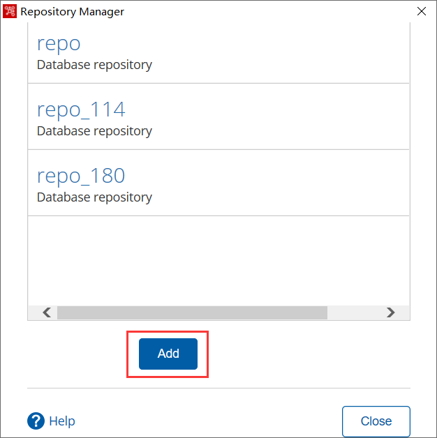
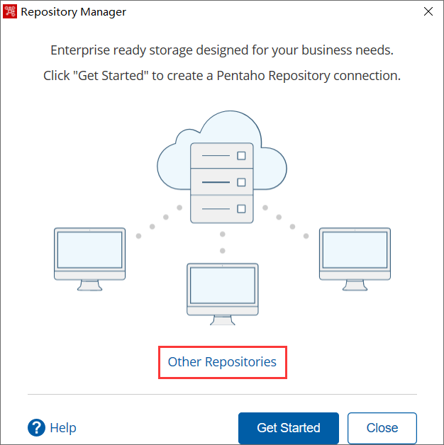
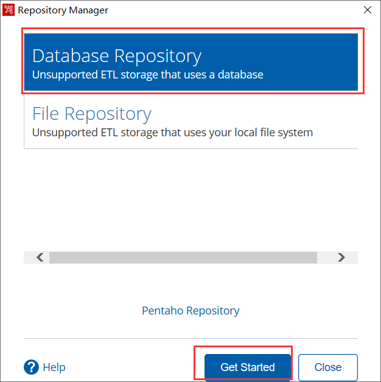
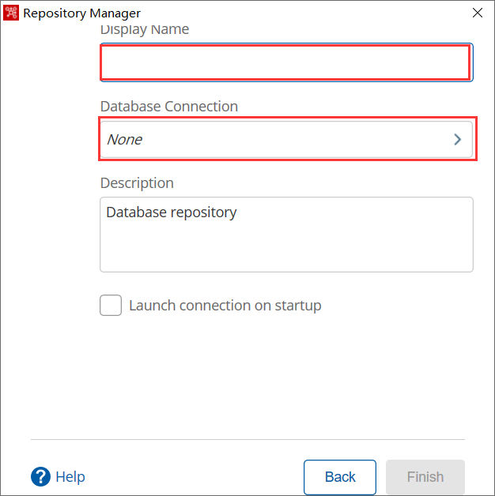
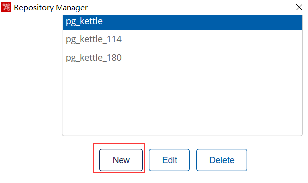
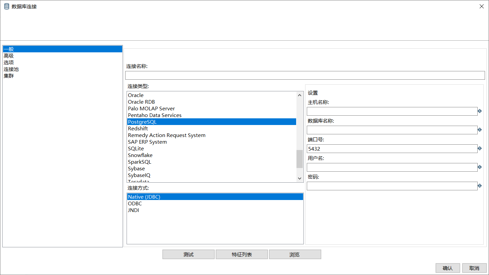
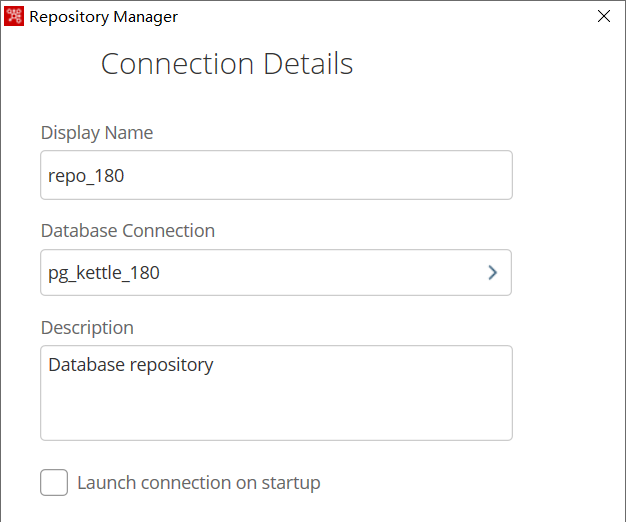

[@id]: 20211213-01.md
[@title]: Linux安装kettle（data-integration）
[@location]: docs/installation/20211213-01.md
[@author]: leity
[@date]: 2021-12-14

## Linux安装kettle（data-integration）

#### 作者

leity

#### 日期

2021-12-13

#### 标签

Linux ，kettle，java

------

## 背景

kettle，data-integration

## 需要安装好java环境

```shell
[root@orig01 ~]# java -version
java version "1.8.0_291"
Java(TM) SE Runtime Environment (build 1.8.0_291-b10)
Java HotSpot(TM) 64-Bit Server VM (build 25.291-b10, mixed mode)
```

## 创建kettle用户

```shell
useradd kettle
passwd kettle
```

## 下载kettle

```shell
wget https://nchc.dl.sourceforge.net/project/pentaho/Pentaho-9.2/client-tools/pdi-ce-9.2.0.0-290.zip
```

## 解压文件

```shell
unzip pdi-ce-9.2.0.0-290.zip
mv data-integration/ /opt/
chown kettle:root -R /opt/data-integration/
```

## 测试

```shell
[kettle@orig01 data-integration]$./pan.sh -file=samples/transformations/'CSV Input - Reading customer data.ktr'
#######################################################################
WARNING:  no libwebkitgtk-1.0 detected, some features will be unavailable
    Consider installing the package with apt-get or yum.
    e.g. 'sudo apt-get install libwebkitgtk-1.0-0'
#######################################################################
15:16:31,933 INFO  [KarafBoot] Checking to see if org.pentaho.clean.karaf.cache is enabled
15:16:32,012 INFO  [KarafInstance] 
*******************************************************************************
*** Karaf Instance Number: 1 at /opt/data-integration/./system/karaf/caches ***
***   /pan/data-1                                                           ***
*** Karaf Port:8802                                                         ***
*** OSGI Service Port:9051                                                  ***
*******************************************************************************
Dec 14, 2021 3:16:33 PM org.apache.karaf.main.Main$KarafLockCallback lockAcquired
INFO: Lock acquired. Setting startlevel to 100
....
2021/12/14 15:16:45 - Pan - Start of run.
2021/12/14 15:16:46 - CSV Input - Reading customer data - Dispatching started for transformation [CSV Input - Reading customer data]
2021/12/14 15:16:46 - CSV file input.0 - Header row skipped in file 'file:///opt/data-integration/samples/transformations/files/customers-100.txt'
2021/12/14 15:16:46 - CSV file input.0 - Finished processing (I=101, O=0, R=0, W=100, U=0, E=0)
2021/12/14 15:16:46 - Filter rows.0 - Finished processing (I=0, O=0, R=100, W=5, U=0, E=0)
2021/12/14 15:16:46 - Dummy (do nothing).0 - Finished processing (I=0, O=0, R=5, W=5, U=0, E=0)
2021/12/14 15:16:46 - Carte - Installing timer to purge stale objects after 1440 minutes.
2021/12/14 15:16:46 - Pan - Finished!
2021/12/14 15:16:46 - Pan - Start=2021/12/14 15:16:46.105, Stop=2021/12/14 15:16:46.273
2021/12/14 15:16:46 - Pan - Processing ended after 0 seconds.
2021/12/14 15:16:46 - CSV Input - Reading customer data -  
2021/12/14 15:16:46 - CSV Input - Reading customer data - Step CSV file input.0 ended successfully, processed 100 lines. ( - lines/s)
2021/12/14 15:16:46 - CSV Input - Reading customer data - Step Filter rows.0 ended successfully, processed 100 lines. ( - lines/s)
2021/12/14 15:16:46 - CSV Input - Reading customer data - Step Dummy (do nothing).0 ended successfully, processed 5 lines. ( - lines/s)
```

## 创建资源库

登录数据库，创建kettle资源库数据库和schema

```sql
--创建用户和数据库
postgres=# create user kettle password 'xxxxx';
postgres=# create database kettle_db owner kettle;
postgres=# \c kettle_db
postgres=# drop schema public;

--登录数据库
psql -U kettle -d kettle_db -W
kettle_db=> create schema kettle authorization kettle;
```

windows启动spoon，右上角找到“Repository Manager”点击，新增资源库















## 查看数据库

```shell
kettle_db=> \d
                                  List of relations
 Schema |                          Name                          |   Type   | Owner  
--------+--------------------------------------------------------+----------+--------
 kettle | r_cluster                                              | table    | kettle
 kettle | r_cluster_id_cluster_seq                               | sequence | kettle
 kettle | r_cluster_slave                                        | table    | kettle
```

kettle下面已经有了一系列的对象，资源库已经生成

## linux创建资源库连接信息文件

`vim /home/kettle/.kettle/repositories.xml`

```xml
<?xml version="1.0" encoding="UTF-8"?>
<repositories>
    <connection>
        <name>pg_kettle_180</name>
        <server>127.0.0.1</server>
        <type>POSTGRESQL</type>
        <access>Native</access>
        <database>kettle_db</database>
        <port>5432</port>
        <username>kettle</username>
        <password>Encrypted 69dbecdba40f898488ae10ba699091a0d7</password>
        <servername/>
        <data_tablespace/>
        <index_tablespace/>
        <attributes>
            <attribute><code>FORCE_IDENTIFIERS_TO_LOWERCASE</code><attribute>N</attribute></attribute>
            <attribute><code>FORCE_IDENTIFIERS_TO_UPPERCASE</code><attribute>N</attribute></attribute>
            <attribute><code>IS_CLUSTERED</code><attribute>N</attribute></attribute>
            <attribute><code>PORT_NUMBER</code><attribute>5432</attribute></attribute>
            <attribute><code>PRESERVE_RESERVED_WORD_CASE</code><attribute>Y</attribute></attribute>
            <attribute><code>QUOTE_ALL_FIELDS</code><attribute>N</attribute></attribute>
            <attribute><code>SUPPORTS_BOOLEAN_DATA_TYPE</code><attribute>Y</attribute></attribute>
            <attribute><code>SUPPORTS_TIMESTAMP_DATA_TYPE</code><attribute>Y</attribute></attribute>
            <attribute><code>USE_POOLING</code><attribute>N</attribute></attribute>
        </attributes>
    </connection>
    <repository>
        <id>KettleDatabaseRepository</id>
        <name>repo_180</name>
        <description>Database repository</description>
        <is_default>true</is_default>
        <connection>pg_kettle_180</connection>
    </repository>
</repositories>
```

## 执行资源库任务

```shell
# 执行转换
/opt/data-integration/pan.sh -rep repo_180 -user admin -pass admin -dir / -trans test
# 执行作业
/opt/data-integration/kitchen.sh -rep repo_180 -user admin -pass admin -dir / -job test
```

